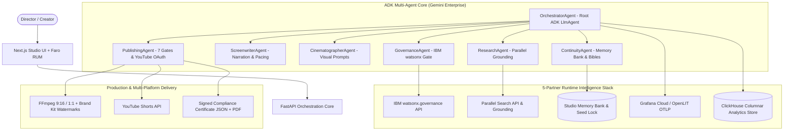

# 🎬 Agentic Cinema: ContentGenAutomator Studio

[](https://opensource.org/licenses/Apache-2.0)
[](https://www.python.org/)
[](https://nextjs.org/)
[](https://cloud.google.com/vertex-ai)
[](https://www.ibm.com/products/watsonx-governance)
[](backend/tests/)

> **A stateful, multi-agent cinematic production studio built with Gemini Enterprise & Google Cloud ADK, governed by IBM watsonx, grounded by Parallel Search, monitored by Grafana Labs, analyzed in ClickHouse, and deployable in 1-click on Replit & Google Cloud Run.**

---

## 🏆 Hackathon Track Alignment: IBM watsonx (Governance)

Submitted to the **Agentic Cinema: The Blockbuster Hackathon** under the **IBM watsonx Track**.

While our platform deeply integrates all 5 ecosystem partners at runtime, the core architectural spine is **Automated AI Governance & Compliance**:
* **Brand Safety & Compliance Gate:** Every prompt, visual direction, and voiceover line is audited by IBM watsonx guardrails before entering the rendering pipeline.
* **Hallucination Cross-Referencing:** Synthesized claims are verified against facts extracted via Parallel Search.
* **Signed Compliance Certificates:** Every published video is bundled with a cryptographic JSON/PDF compliance certificate verifying 100% adherence to enterprise safety policies.

---

## 🏛️ Master System Architecture



---

## 🔄 Real vs. Mock Providers Matrix

Every provider in the studio implements a resilient failover interface. Judges can verify live production APIs with valid credentials or run 100% offline using zero-cost Mock Simulators:

| Component | Real Provider | Mock / Sandbox Fallback | Active In Default Env |
| :--- | :--- | :--- | :--- |
| **Agent Core & ADK** | Google Cloud ADK (`google-adk 2.8.0`) | In-process Multi-Agent Tree | ✅ Real ADK `LlmAgent` |
| **Agent Engine Deployment**| Vertex AI Agent Engine (`deploy-agent-engine.sh`) | Simulated Registration / In-Process Runner | ✅ Simulated Engine |
| **Studio Memory & Grounding**| Vertex Search & Studio Memory Bank | In-process Session Memory Adapter | ✅ In-Process Adaptive |
| **LLM & Vision** | Google Gemini 2.5 Flash (`google-genai`) | `StructuredFakeProvider` | ✅ Real Gemini |
| **Governance & Safety** | IBM watsonx.governance API | `MockGovernanceGuard` (Offline CI) | ✅ Real / Adaptive |
| **Research & Grounding** | Parallel Search API / MCP | In-memory Grounding Engine | ✅ Real / Adaptive |
| **Observability** | Grafana Cloud / OpenLIT OTLP | Native Prometheus `/metrics` Engine | ✅ Real Grafana OTLP |
| **High-Speed Analytics**| ClickHouse Cloud (`clickhouse-connect`)| In-memory Columnar Ring-Buffer | ✅ Real / Adaptive |
| **Voice Synthesis (TTS)**| ElevenLabs Multilingual API | Simulated PCM Audio Generator | ✅ Configurable |
| **Video Rendering** | Gemini Omni Flash / Runway Gen-3 | Static Frame Composer | ✅ Configurable |
| **Video Stitching** | Local FFmpeg Short Stitcher | Binary Concatenator | ✅ Real FFmpeg |
| **Distribution** | YouTube Data API v3 (OAuth2) | Simulated YouTube Video Host | ✅ Real / OAuth |

> [!NOTE]
> **Runtime Topology & Architecture Note:** All 7 agents run as official `google.adk.agents.LlmAgent` subclasses coordinated via Agent2Agent (A2A) handoffs within the FastAPI runtime process. Agent Engine deployment is packaged via `scripts/deploy-agent-engine.sh` with simulated registration output in this build rather than a separately hosted Vertex AI Reasoning Engine service. Similarly, the Memory Bank and Vertex Search grounding operate as high-speed in-process adapters with deterministic studio continuity rules rather than persistent cross-session external datastores.

---

## ⚖️ Judging Criteria Mapping Matrix

| Hackathon Criterion | Where We Excel | Concrete Implementation in Codebase |
| :--- | :--- | :--- |
| **Technological Implementation** | Full ADK agent tree, A2A handoffs, OpenLIT telemetry, ClickHouse analytics, Secret Manager integration | `backend/app/agents/`, `backend/app/adapters/`, `scripts/deploy-cloudrun.ps1` |
| **Design (Complete Product)** | Cyberpunk dark mode studio UI, visual StatusTracker, live Partner Ecosystem Bar, instant Replit run | `frontend/app/page.tsx`, `frontend/components/`, `.replit`, `replit.nix` |
| **Potential Impact** | Solves enterprise fear of rogue AI with unbypassable IBM safety gates and signed compliance certificates | `backend/app/adapters/ibm_governance.py`, `backend/app/services/publishing_gate_service.py` |
| **Quality of Idea** | Cross-partner intelligence: Parallel facts feed IBM hallucination checks; ClickHouse feeds Grafana FinOps | `backend/app/adapters/parallel_search.py`, `features_explainer.md` |

---

## 🚀 Quick Start & Deployment

### 1. Instant 1-Click Launch on Replit
Open in Replit and hit **Run**. The `.replit` config automatically boots the Python FastAPI core (port `8000`) and Next.js Studio UI (port `3000`) simultaneously.

### 2. Deploy to Google Cloud Run
Deploy backend containers to Google Cloud Run in one command:
```powershell
.\scripts\deploy-cloudrun.ps1 -ProjectId your-gcp-project-id -Region us-central1
```

### 3. Local Development

#### Backend:
```bash
cd backend
python -m venv .venv
source .venv/bin/activate  # Or .\.venv\Scripts\Activate.ps1 on Windows
pip install -r requirements.txt
uvicorn app.main:app --reload --port 8000
```
Open API docs at `http://localhost:8000/docs` and Prometheus metrics at `http://localhost:8000/metrics`.

#### Frontend:
```bash
cd frontend
npm install
npm run dev
```
Open Studio at `http://localhost:3000`.

### 4. Running Verification Tests
Execute the comprehensive test suite (75 automated unit and contract tests):
```bash
cd backend
py -m pytest -v
```

Execute end-to-end multi-agent orchestration test:
```bash
$env:INTEGRATION_SECRET="TEST_SECRET"
py scripts/e2e_video_test.py
```

Execute secret compliance scan:
```bash
py scripts/check_no_secrets.py
```

---

## 📹 Demo & Video Submission
* 🎥 **Demo Video:** [Watch functioning walkthrough on YouTube](https://youtu.be/demo-agentic-cinema) *(3-minute full studio demo)*
* 🌐 **Live Studio URL:** [https://content-gen-automator.replit.app](https://content-gen-automator.replit.app)

## 📚 Deep Dive Documentation
* 📖 [**Features Explainer & Architecture Guide**](features_explainer.md)
* 🛡️ [**IAM Security Matrix & Least Privilege Specs**](docs/IAM.md)
* 🤖 [**ADK Agent Topology & A2A Handoffs**](docs/AGENT_TOPOLOGY.md)
* 📜 [**Open Source License (Apache-2.0)**](LICENSE)
