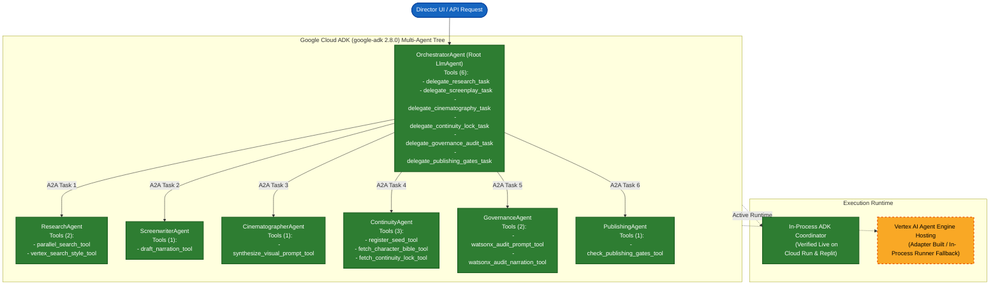

# ADK Multi-Agent Topology & A2A Handoff Subsystem

The multi-agent core is built with the official **Google Cloud Agent Development Kit (`google-adk 2.8.0`)**, running 7 specialized agents that subclass `google.adk.agents.LlmAgent`. In the active production deployment on Google Cloud Run and Replit, all 7 agents execute in-process within the FastAPI container using direct Agent2Agent (A2A) tool delegations; remote hosting on Vertex AI Agent Engine is built as an adapter with an automated in-process runner fallback.

