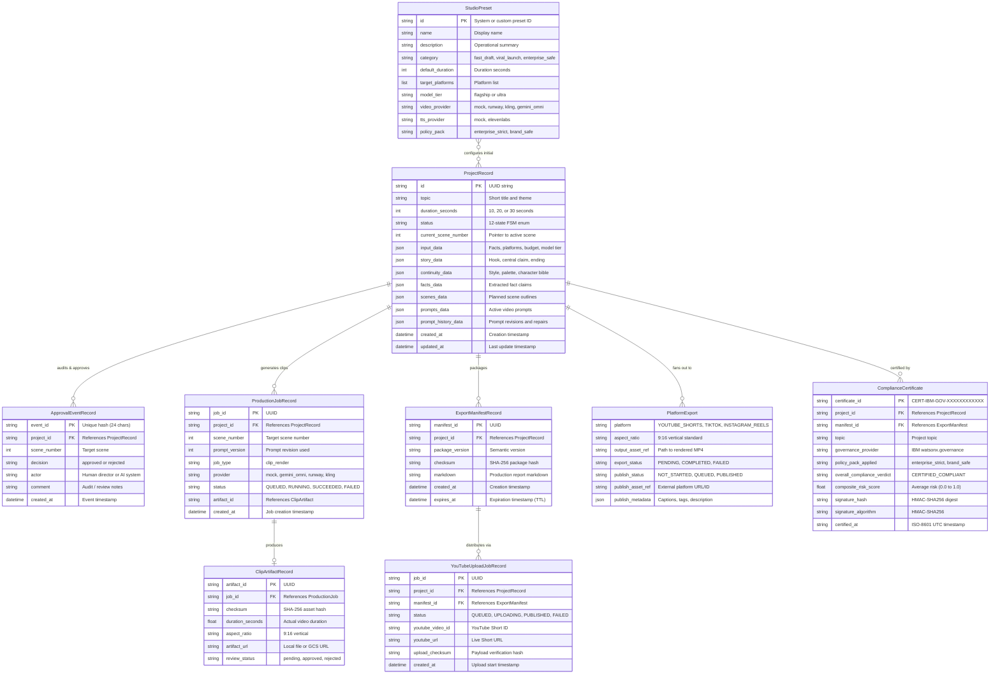

# Domain Data Model & Persistence Architecture

The domain data model is orchestrated in `backend/app/domain/project.py` and backed by the SQLAlchemy persistence layer in `backend/app/repositories/sql.py`. State transitions and nested multi-platform deliverables are stored using structured relational tables with versioned JSON payload contracts for scene bibles, multi-platform exports, and audit trails.

