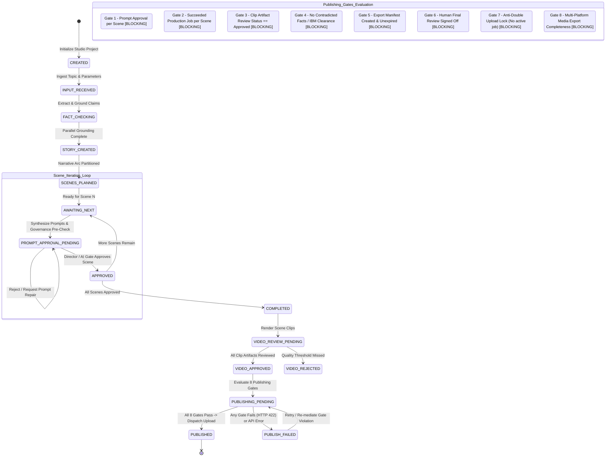

# Project Publishing Lifecycle & 8-Gate FSM

The studio strictly enforces a 12-state Finite State Machine (`ProjectStatus` in `backend/app/domain/project.py`) to prevent illegal lifecycle jumps. Before any video can be published or distributed, `backend/app/services/publishing_gate_service.py` executes an 8-gate fail-closed verification pipeline; any single failed gate returns HTTP 422 and halts delivery.

