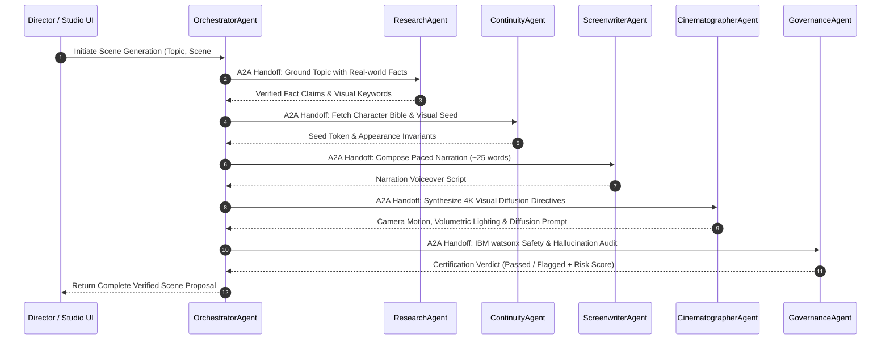

# 🤖 ADK Multi-Agent Topology & Agent2Agent (A2A) Protocols

This document details the multi-agent hierarchy built with the **Google Cloud Agent Development Kit (ADK 2.8.0)**. In this release, the complete ADK multi-agent tree executes in-process within the FastAPI service; deployment to Vertex AI Agent Engine is packaged via `scripts/deploy-agent-engine.sh` with simulated registration output; memory bank character bibles and style datastore guidelines persist via local atomic durable file storage (`.storage/`).

---

## Agent Hierarchy & Tool Capabilities

```
OrchestratorAgent (Root ADK LlmAgent)
├── ResearchAgent (ADK Specialist)
│   ├── parallel_search_tool() [Parallel Search API]
│   └── vertex_search_style_tool() [House Style Datastore Adapter]
│
├── ScreenwriterAgent (ADK Specialist)
│   ├── draft_narration() [Pacing & Word-Budget Constraints]
│   └── score_pacing() [2.5 words/sec Target Validator]
│
├── CinematographerAgent (ADK Specialist)
│   ├── synthesize_visual_prompt() [Diffusion Lighting & Camera Rules]
│   └── process_moodboard_frame() [Multimodal Image Reference]
│
├── ContinuityAgent (ADK Specialist)
│   ├── fetch_character_bible() [Durable Memory Bank Adapter]
│   └── register_seed() [Cross-Project Visual Seed Persistence]
│
├── GovernanceAgent (ADK Specialist)
│   ├── watsonx_audit_prompt_tool() [IBM watsonx.governance API]
│   ├── watsonx_audit_narration_tool() [Hallucination & PII Detection]
│   └── compute_risk_score() [Normalized Risk Classification]
│
└── PublishingAgent (ADK Specialist)
    ├── check_publishing_gates_tool() [7 Fail-Closed Security Gates]
    ├── generate_compliance_certificate() [Signed JSON/PDF Certificate]
    └── youtube_upload() [YouTube Data API v3 OAuth2]
```

---

## Agent2Agent (A2A) Protocol Sequence



---

## Technical Invariants
1. **Agent Proposes, FSM Disposes:** The agents reason over inputs and propose state transitions; the underlying Python Finite State Machine guarantees no illegal state jump is ever executed.
2. **Deterministic Durations:** 10s (1 scene), 20s (2 scenes), 30s (3 scenes).
3. **Cross-Project Memory Bank:** Character visual traits and brand voice guidelines persist across projects in the Director's studio portfolio.
