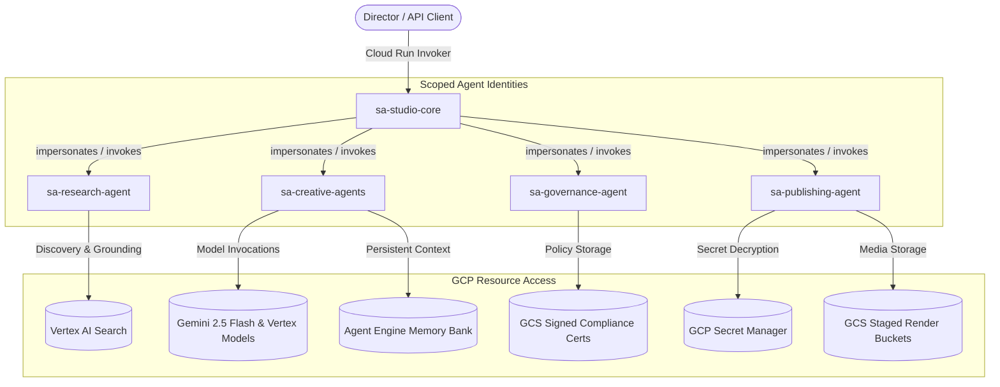

# 🛡️ Cloud IAM Security & Least Privilege Architecture

This document specifies the Google Cloud IAM least-privilege architecture for the **ContentGenAutomator Studio Core** and its multi-agent workforce running on **Gemini Enterprise Agent Platform / Agent Engine**.

---

## Service Account Topology

---

## Least Privilege IAM Role Matrix

| Service Account Identity | Dedicated Agent Scope | Granted GCP IAM Roles | Security Rationale |
| :--- | :--- | :--- | :--- |
| `sa-studio-core@PROJECT.iam.gserviceaccount.com` | FastAPI Service Host | `roles/run.invoker` `roles/serviceusage.serviceUsageConsumer` | Ingress gateway routing HTTP requests to Agent Engine. |
| `sa-research-agent@PROJECT.iam.gserviceaccount.com` | `ResearchAgent` | `roles/discoveryengine.viewer` `roles/aiplatform.user` | Queries Vertex AI Search datastores without write or export permissions. |
| `sa-creative-agents@PROJECT.iam.gserviceaccount.com` | `Screenwriter`, `Cinematographer`, `Continuity` | `roles/aiplatform.user` `roles/agentengine.sessionUser` | Invokes Gemini 2.5 Flash and reads/writes to studio Memory Bank. |
| `sa-governance-agent@PROJECT.iam.gserviceaccount.com` | `GovernanceAgent` | `roles/storage.objectCreator` `roles/aiplatform.user` | Audits prompts and writes immutable Compliance Certificates to GCS. |
| `sa-publishing-agent@PROJECT.iam.gserviceaccount.com` | `PublishingAgent` | `roles/secretmanager.secretAccessor` `roles/storage.objectAdmin` | **Only SA with access to YouTube OAuth secrets** and final distribution staging. |

---

## Cryptographic Token Integrity & Auditability
1. **Secret Manager Isolation:** YouTube Refresh Tokens and ElevenLabs keys are accessible **only** to `sa-publishing-agent` at final publish execution time.
2. **Idempotency Fingerprinting:** Every mutating operation hashes caller tokens with `X-Request-ID` and `Idempotency-Key` to prevent double-spending rendering credits.
3. **Audit Immutability:** Audit events are signed and streamed to both Google Cloud Logging and ClickHouse.
